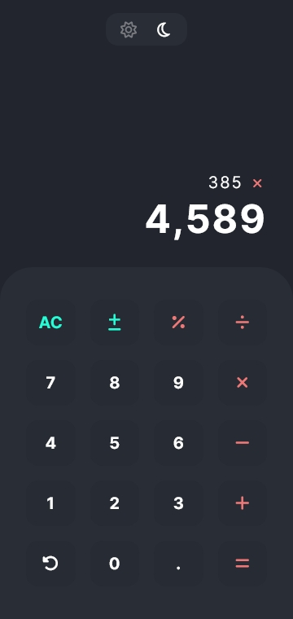

# Calculator app
Calculator app for performing basic arithemtic.\
Check out the live app [here](https://abedfetrat.github.io/simple-calculator-app/)

## Screenshot

## Features
- Perform arithemtic (percentage, addition, subtraction, division and multiplication) calculations. 
- Switch between light and dark theme
- Install app on homescreen for offline use

## Built with
- HTML
- CSS
- Javascript